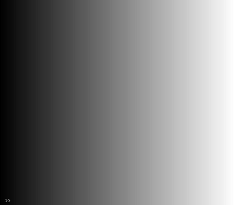

# ramps
Ramp Generator for Hydra
## Description
Hydra already contains the gradient object but I thought it would be interesting to have different forms of ramps more readily available. These ramps are permutations of linear, logarithmic, exponential etc. Mirrored ramps will also be available. The goal is to have mulitple ramp types that are available with much quicker recall to generate more complex geometry.

Ramps can be added to a Hydra project by typing await loadScript('https://cdn.jsdelivr.net/gh/ncavazos/ramps@main/ramps.js') at the top of your hydra project

### Types
Linear  
  
Logarithmic  
  
Exponential  
  

